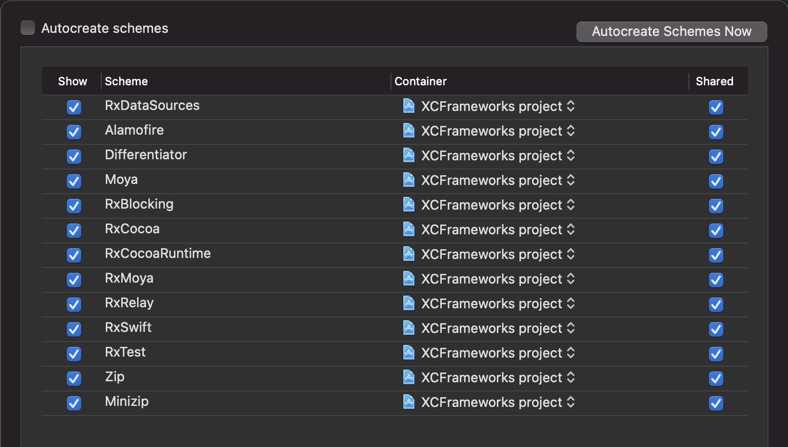

# XCFrameworks for nested dependencies

1. Add new dependency
  
  Edit file Package.swift
  
2. Generate xcodeproj
  
  ```shell
  swift package generate-xcodeproj 
  ```
  
3. Update project scheme
  
  
  
4. Build frameworks
  
  ```shell
    ./build_xcframework.sh
  ```
  
5. Release & upload xcframeworks
  
  - Create release with semantic versioning rules
    
  - Zip folder Carthage/Build and rename "any.xcframework.zip"
    
  - Upload "any.xcframework.zip" to github
